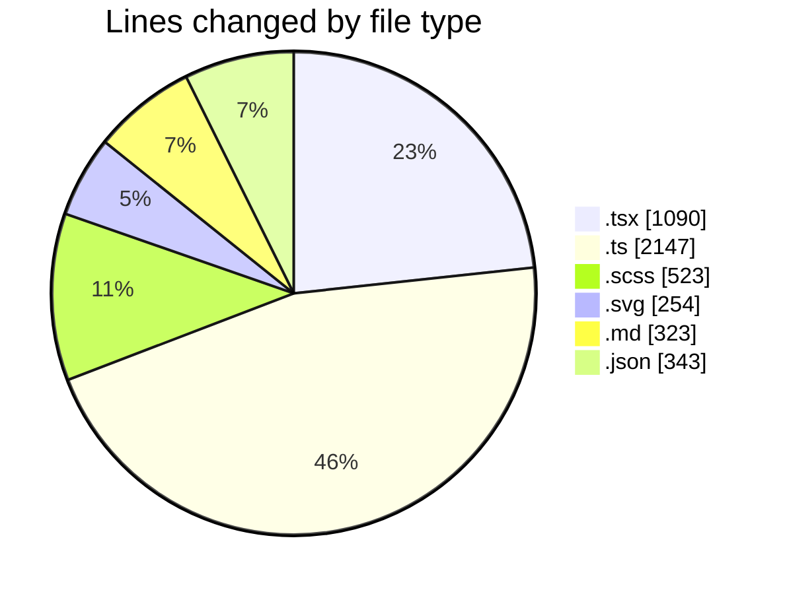
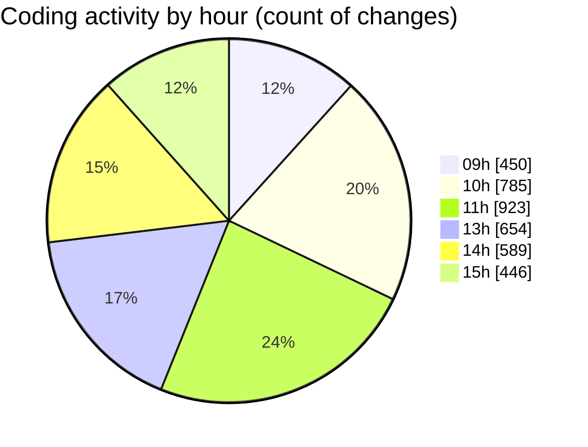

# My Code Activity Extension

Track your coding activity automatically and build a comprehensive history of your development journey. This VS Code extension seamlessly records your coding sessions and commits them to a private GitHub repository, helping you maintain a detailed log of your programming activities.

## ✨ Key Features

- **🔄 Automatic Activity Tracking**

  - Tracks lines of code added/removed
  - Monitors active coding time
  - Records file modifications
  - Creates automatic commits at customizable intervals

- **📊 Comprehensive Statistics**

  - Daily activity breakdowns
  - Project-level analytics
  - File type statistics
  - Time distribution analytics

- **🔐 Secure & Private**

  - Secure GitHub authentication
  - Private repository storage
  - Full control over your data

- **⚡ Easy to Use**
  - One-click GitHub sign-in
  - Simple enable/disable toggle
  - Minimal configuration needed

## 🚀 Example Usage

Here's an example of the activity summary that gets generated:

# my-code-activity-ext - Activity Summary 

## Overall Statistics

| Stat                   | Value                                |
| ---------------------- | ------------------------------------ |
| **Lines Added** (➕)   | 3,847                               |
| **Lines Removed** (➖) | 1,256                               |
| **Net Change** (↕)    | +2,591                              |
| **Active Time** (⌚)   | 6 hours 45 minutes                  |

## Modified Files
- **src/features/dashboard/components/AnalyticsChart.tsx** (+856, -234)
- **src/api/activityTracker.ts** (+745, -122)
- **src/hooks/useActivityMetrics.ts** (+523, -89)
- **styles/dashboard.scss** (+367, -156)
- **src/utils/dataTransformers.ts** (+312, -45)
- **tests/integration/tracking.test.ts** (+289, -0)
- **src/store/activitySlice.ts** (+278, -167)
- **public/assets/icons/activity.svg** (+156, -98)
- **README.md** (+178, -145)
- **package.json** (+143, -200)

## Visualizations

### By File Type (Lines Changed)

### By Hour (Estimated Activity Count)

### Top Languages

| Language    | Percentage |
|------------|------------|
| TypeScript | 62.8%      |
| SCSS       | 15.4%      |
| SVG        | 8.7%       |
| JSON       | 7.2%       |
| Markdown   | 5.9%       |

> **Last Updated:** 30/12/2024 15:45:23

The extension automatically commits these summaries to your GitHub repository, providing a detailed history of your coding activity. You can view these summaries directly on GitHub, and they include:
- Detailed statistics about lines added/removed
- List of modified files with change counts
- Visual charts showing distribution by file type
- Hourly activity breakdowns
- Automatic timestamps for tracking

## 🚀 Getting Started

1. Install the extension from the [VS Code Marketplace](https://marketplace.visualstudio.com/items?itemName=ernicani.my-code-activity-ext)
2. Open the Command Palette (Ctrl+Shift+P / Cmd+Shift+P)
3. Run `Sign in with GitHub` to authenticate
4. Start coding! The extension will automatically track your activity

## ⚙️ Configuration

Access settings through VS Code's settings (Ctrl+,):

\`\`\`json
{
"codeTracker.commitInterval": 5 // Minutes between activity commits (default: 5)
}
\`\`\`

## 📋 Available Commands

- `Sign in with GitHub`: Connect your GitHub account
- `Toggle Code Tracking`: Enable/disable activity tracking

## 📊 Activity Tracking Details

The extension tracks:

- Lines of code added/removed
- Active coding time (excluding idle periods)
- File modifications with timestamps
- Project-specific statistics
- Language and file type analytics

## 🔧 System Requirements

- VS Code 1.75.0 or higher
- Git installed on your system
- GitHub account
- Internet connection for syncing

## 🤝 Contributing

Contributions are welcome! Feel free to:

- Submit bug reports
- Propose new features
- Create pull requests

## 📄 License

This project is licensed under the MIT License - see the [LICENSE](LICENSE) file for details.

## 🔗 Links

- [VS Code Marketplace](https://marketplace.visualstudio.com/items?itemName=ernicani.my-code-activity-ext)
- [GitHub Repository](https://github.com/ernivani/my-code-activity-ext)
- [Issue Tracker](https://github.com/ernivani/my-code-activity-ext/issues)

---

**Note**: Your activity data is stored in a public GitHub repository that you can make private at any time. The extension never shares your coding activity without your explicit permission.
