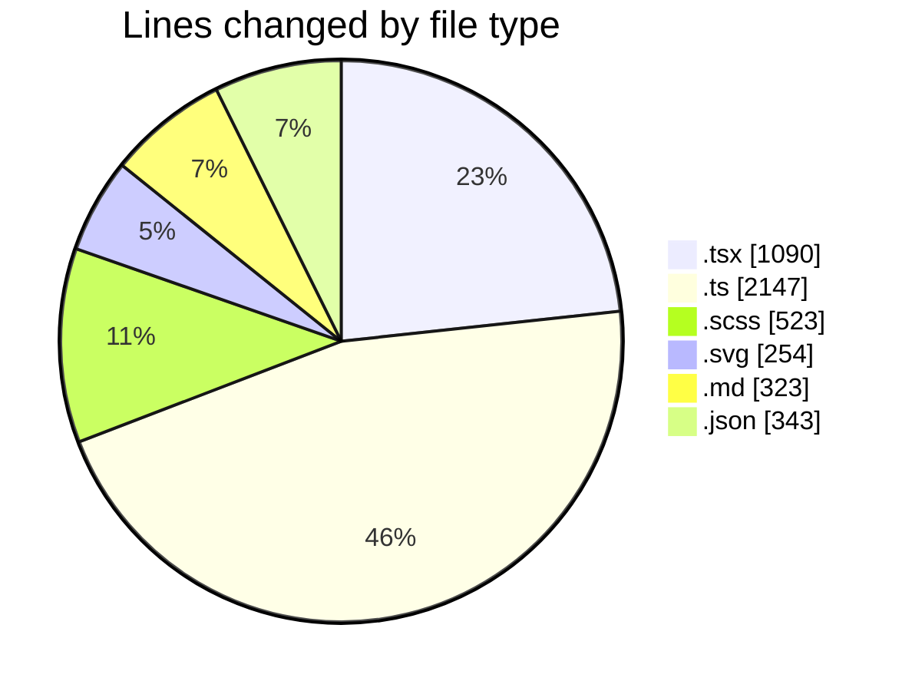
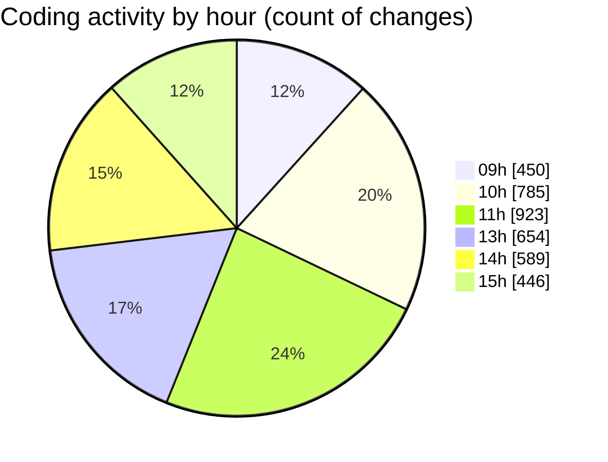

# My Code Activity Extension

Track your coding activity automatically and build a comprehensive history of your development journey. This VS Code extension seamlessly records your coding sessions and commits them to a GitHub repository, helping you maintain a detailed log of your programming activities.

## ✨ Key Features

- **🔄 Enhanced Activity Tracking**
  - Smart change detection and consolidation
  - Function-level modification tracking
  - Intelligent duplicate filtering
  - Language-aware code analysis
  - Automatic commit generation

- **📊 Interactive Dashboard**
  - Real-time activity visualization
  - Daily/Weekly/Monthly views
  - Project distribution charts
  - Language usage breakdown
  - Activity heatmaps
  - Dark/Light theme support

- **🤖 AI-Powered Insights**
  - Generate meaningful commit messages using AI
  - Local LLM support via Ollama for privacy
  - Context-aware messages based on code changes
  - Function-level change detection
  - Smart change consolidation

- **🔐 Secure & Private**
  - Secure GitHub authentication
  - Support for custom Git repositories
  - Support for GitHub Enterprise
  - Full control over your data
  - Local data processing

- **⚡ Developer Experience**
  - One-click GitHub sign-in
  - Automatic change tracking
  - Real-time statistics
  - Customizable settings
  - Minimal setup needed

## 🚀 Visual Analytics Dashboard

The extension now includes a powerful web-based dashboard for visualizing your coding activity. Access it by:
1. Clicking the "Code Tracking" status bar item in VS Code
2. Using the Command Palette (Ctrl+Shift+P / Cmd+Shift+P) and searching for "Code Activity: Open Dashboard"
3. The dashboard will open in your default browser at `http://localhost:3000`

### 📊 Interactive Analytics
- Real-time activity tracking with daily/weekly/monthly views
- Project distribution visualization with doughnut charts
- Language usage breakdown with time percentages
- Hourly activity heatmap showing peak coding times

### 🌈 Dashboard Features
- Modern, GitHub-inspired interface
- Dark/Light theme support matching VS Code preferences
- Responsive design for all screen sizes
- Real-time data updates
- Export capabilities (coming soon)

### 📈 Available Charts
- Activity timeline with trend analysis
- Project distribution pie charts
- Language usage breakdown
- Hourly activity heatmap
- Detailed statistics cards

## 🔐 Authentication Options

The extension now supports two authentication methods:

### 1. GitHub Authentication
1. Open the Command Palette
2. Run "Code Activity: Sign in with GitHub"
3. Follow the browser authentication flow
4. Your activity will be tracked to a private GitHub repository

### 2. Custom Token & Repository
1. Set up your custom Git repository
2. Open VS Code settings
3. Configure `codeTracker.customRemoteUrl` with your repository URL
4. Run "Code Activity: Set Custom Token" from the Command Palette
5. Enter your Git access token
6. The extension will use your custom repository for tracking

## 🚀 Example Usage

Here's an example of the enhanced activity summary that gets generated:

# Activity Summary

## Overall Statistics

| Stat                   | Value                                |
| ---------------------- | ------------------------------------ |
| **Lines Added** (➕)   | 3,847                               |
| **Lines Removed** (➖) | 1,256                               |
| **Net Change** (↕)    | +2,591                              |
| **Active Time** (⌚)   | 6 hours 45 minutes                  |
| **Functions Modified** | 24                                   |
| **Languages Used**     | TypeScript, SCSS, SVG               |

## Code Changes

### Modified Files
- **src/features/dashboard/components/AnalyticsChart.tsx** (+856, -234)
  - Functions: updateChartData, calculateMetrics
- **src/api/activityTracker.ts** (+745, -122)
  - Functions: trackChanges, aggregateStats
- **src/hooks/useActivityMetrics.ts** (+523, -89)
  - Functions: useMetrics, processData

## Visualizations

### By File Type (Lines Changed)

### By Hour (Activity Heatmap)

## 🚀 Getting Started

1. Install the extension from the [VS Code Marketplace](https://marketplace.visualstudio.com/items?itemName=ernicani.my-code-activity-ext)
2. Open the Command Palette (Ctrl+Shift+P / Cmd+Shift+P)
3. Run `Sign in with GitHub` to authenticate
4. Start coding! The extension will automatically track your activity

## ⚙️ Configuration

Access settings through VS Code's settings (Ctrl+,):

\`\`\`json
{
    // Minutes between activity commits
    "codeTracker.commitInterval": 5,
    
    // Custom Git repository URL (for non-GitHub tracking)
    "codeTracker.customRemoteUrl": "https://your-git-server.com/user/repo.git",
    
    // Git branch name for tracking data
    "codeTracker.branchName": "main",
    
    // Enable AI-generated commit messages
    "codeTracker.enableAiCommits": false,
    
    // Ollama server URL
    "codeTracker.ollamaUrl": "localhost:11434",
    
    // Ollama model for commit messages
    "codeTracker.ollamaModel": "codellama"
}
\`\`\`

### AI Commit Messages

The extension can generate meaningful commit messages using AI:

1. Install [Ollama](https://ollama.ai/) on your system
2. Pull the codellama model: `ollama pull codellama`
3. Enable AI commits in VS Code settings
4. The extension will now generate context-aware commit messages

Example AI-generated commit message:
\`\`\`
feat(tracking): update dashboard components and analytics

- Modified functions: updateChartData, calculateMetrics
- Files: AnalyticsChart.tsx, activityTracker.ts
- Activity duration: 15 minutes
- Function changes: 2 added, 1 modified
\`\`\`

## 📊 Enhanced Tracking Details

The extension now tracks:

- **Code Changes**
  - Lines added/removed
  - Function-level modifications
  - Language-specific changes
  - Project context

- **Time Analytics**
  - Active coding time
  - Time per project
  - Peak activity hours
  - Language usage time

- **Project Metrics**
  - Project-specific statistics
  - Language distribution
  - Most modified files
  - Function change frequency

## 🔧 System Requirements

- VS Code 1.75.0 or higher
- Git installed on your system
- GitHub account (or custom Git repository)
- Internet connection for syncing
- Ollama (optional, for AI commit messages)

## 🤝 Contributing

We welcome contributions! Please see our [CONTRIBUTING.md](CONTRIBUTING.md) guide for details on:

- Development setup and workflow
- Code style guidelines
- Pull request process
- Testing requirements
- Available scripts and commands
- Extension configuration
- Community guidelines

Before contributing:
1. Fork and clone the repository
2. Install dependencies: `npm install`
3. Create a feature branch
4. Make your changes following our guidelines
5. Submit a pull request

For detailed instructions, see [CONTRIBUTING.md](CONTRIBUTING.md).

## 📄 License

This project is licensed under the MIT License - see the [LICENSE](LICENSE) file for details.

## 🔗 Links

- [VS Code Marketplace](https://marketplace.visualstudio.com/items?itemName=ernicani.my-code-activity-ext)
- [GitHub Repository](https://github.com/ernivani/my-code-activity-ext)
- [Issue Tracker](https://github.com/ernivani/my-code-activity-ext/issues)

---

**Note**: Your activity data is stored in a Git repository that you control. The extension never shares your coding activity without your explicit permission.
